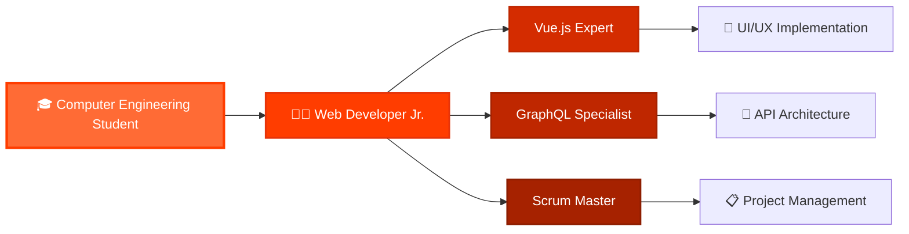

  

  

---

## 
🌟 Bienvenido a mi perfil gitHub 🌟

### 🚀 Sobre mí <3

  

Hola!!! Soy **Ignacio Pérez Olavarría**, un apasionado desarrollador de 23 años desde las hermosas tierras de **Puerto Montt, Chile** 🇨🇱. egresado de  **Ingeniería en Informática UST**, donde cada día descubro nuevas formas de transformar ideas en código que cobra vida. Mi lenguaje favorito: python puedes visitar mi portafolio https://nachoportafolio.me/ o mi blog https://nachoblog.hashnode.dev/

Mi historia comenzó con una simple curiosidad por entender cómo funcionan las cosas, y hoy me encuentro trabajando como **Desarrollador Web Jr. en VOID IT SOLUTIONS SPA**. Mi especialidad está en **Vue.js y PostgreSql**, tecnologías que me permiten crear experiencias web fluidas y dinámicas. experto en github

 

  

  
  
  
  

 
---

## 
🛠️ Tech Arsenal & Superpowers

  

<table align="center">
<tr>
<td align="center" width="50%">

### 🎨 Frontend

  

  

</td>
<td align="center" width="50%">

### ⚙️ Backend Power

  

  

</td>
</tr>
</table>

  
### 🚀 Development Tools

  

  

---

## 
💼 Professional Journey :D

  
  
  

### 🔥 Current Professional Status
- **🏢 Company:** VOID IT SOLUTIONS SPA (Enero 2025 - Mayo 2025)
- **📍 Work Mode:** Remote from Puerto Montt, Chile
- **🛠️ Tech Stack:** Vue.js + GraphQL + Hasura
- **👥 Methodology:** Scrum & Agile Development
- **🎯 Focus:** Component Development, API Integration, Documentation

---
## 
🎵 Vibes de Codificación

  
  
  

  <h3>🎧 Ritmos que Potencian mi Código</h3>
  
<em>"Melodías suaves fluyendo por el teclado, creando la atmósfera perfecta para la innovación y el enfoque"</em>

  
  
  
    
  

---

## 
⭐ Proyectos Destacados

| Proyecto | Descripción | Tech Stack | Links |
|----------|-------------|-----------|-------|
| 🎯 **Sistema de Monitoreo de Activos** | Plataforma web orientada al monitoreo y gestión de activos con generación de alertas y reportes en tiempo real. |    | [🔗 Demo](https://smtr-web.netlify.app/principal) \| [📝 Blog](https://nachoblog.hashnode.dev/smtr-construyendo-un-sistema-de-monitoreo-electrico-en-tiempo-real) |
| 🎮 **Mini Juegos** | Colección de mini juegos web interactivos incluyendo el juego del gato y ahorcado. |    | [🔗 Jugar](https://mini-juegos.netlify.app/) \| [📝 Blog](https://nachoblog.hashnode.dev/mini-juegos) |
| 🕹️ **Videojuego Python** | Videojuego desarrollado con Python durante mis años de aprendizaje intensivo. |   | [💻 Repo](https://github.com/NachoOFC/Videojuego) \| [🔗 Jugar](https://eljarl.netlify.app/) |
| 📚 **Mi Blog** | Blog personal donde comparto experiencias, aprendizajes y tips sobre desarrollo web moderno. |  | [📖 Visitar](https://nachoblog.hashnode.dev/) |
| 🏨 **UST Reserve** | Aplicación web en desarrollo para gestión de reservas. |    | [🔗 Preview](https://ust-reserve.netlify.app/) |
| 📦 **Alogis** | Proyecto de gestión logística en desarrollo. |    | [🔗 Preview](https://alogis.netlify.app/) |
| 🌙 **Landing Page** | Landing page colaborativa enfocada en mostrar servicios y soluciones web. |   | [🔗 Visitar](https://moon-systems.netlify.app/) |

---

  

