```mermaid
graph TD
    A[🚀 Learning Journey] --> B[Cloud Architecture]
    A --> C[AI/ML Integration]
    A --> D[Microservices]
    B --> E[AWS Solutions]
    C --> F[TensorFlow/PyTorch]
    D --> G[Docker & Kubernetes]
    
    style A fill:#ff6b6b
    style B fill:#4ecdc4
    style C fill:#45b7d1
    style D fill:#96ceb4
```

# <div align="center">🚀 IGNACIO PÉREZ 🚀</div>

<div align="center">
  
</div>

<div align="center">
  <a href="# <div align="center">🚀 IGNACIO PÉREZ 🚀</div>

<div align="center">
  
</div>

<div align="center">
  <a href="https://git.io/typing-svg">
    
  </a>
</div>

---

## <div align="center">🌟 Welcome to My Digital Universe 🌟</div>


### 👨‍💻 About Me

```typescript
interface Developer {
  name: string;
  location: string;
  passion: string[];
  currentFocus: string;
  skills: {
    languages: string[];
    frameworks: string[];
    tools: string[];
  };
  motto: string;
}

const ignacio: Developer = {
  name: "Ignacio Pérez",
  location: "Chile 🇨🇱",
  passion: ["Innovation", "Problem Solving", "Clean Code"],
  currentFocus: "Full Stack Development & Cloud Technologies",
  skills: {
    languages: ["JavaScript", "TypeScript", "Python", "Java"],
    frameworks: ["React", "Next.js", "Node.js", "Express"],
    tools: ["Docker", "AWS", "Git", "MongoDB"]
  },
  motto: "Code is poetry written in logic 🎯"
};
```

<br clear="right"/>

---

## <div align="center">🛠️ Tech Arsenal</div>

<div align="center">

### Frontend Mastery


### Backend Power


### DevOps & Tools


</div>

---

## <div align="center">📊 GitHub Analytics</div>

<div align="center">
  
  
</div>

<div align="center">
  
</div>

<div align="center">
  
</div>

---

## <div align="center">🏆 Achievements & Trophies</div>

<div align="center">
  
</div>

---

## <div align="center">🎯 Current Focus</div>

<div align="center">



</div>

---

## <div align="center">🌐 Connect With Me</div>

<div align="center">
  <a href="https://github.com/NachoOFC" target="_blank">
    
  </a>
  <a href="https://www.instagram.com/nachoofc/" target="_blank">    
    
  </a>
  <a href="mailto:your.email@example.com" target="_blank">
    
  </a>
  <a href="https://linkedin.com/in/your-profile" target="_blank">
    
  </a>
</div>

---

## <div align="center">💡 Featured Projects</div>

<div align="center">
  <a href="https://github.com/NachoOFC/your-awesome-project">
    
  </a>
  <a href="https://github.com/NachoOFC/another-cool-project">
    
  </a>
</div>

---

## <div align="center">📈 Contribution Graph</div>

<div align="center">
  
</div>

---

## <div align="center">🎵 Currently Vibing To</div>

<div align="center">
  
</div>

---

## <div align="center">💭 Random Dev Quote</div>

<div align="center">
  
</div>

---

<div align="center">
  <h2>🚀 Let's Build Something Epic Together! 🚀</h2>
  <p>
    
    
    
  </p>
</div>

<div align="center">
  <i>"The only way to do great work is to love what you do." - Steve Jobs</i>
  <br><br>
  
</div>

<div align="center">
  
</div>
">
    
  </a>
</div>

---

## <div align="center">🌟 Welcome to My Digital Universe 🌟</div>


### 👨‍💻 About Me

```typescript
interface Developer {
  name: string;
  location: string;
  passion: string[];
  currentFocus: string;
  skills: {
    languages: string[];
    frameworks: string[];
    tools: string[];
  };
  motto: string;
}

const ignacio: Developer = {
  name: "Ignacio Pérez",
  location: "Chile 🇨🇱",
  passion: ["Innovation", "Problem Solving", "Clean Code"],
  currentFocus: "Full Stack Development & Cloud Technologies",
  skills: {
    languages: ["JavaScript", "TypeScript", "Python", "Java"],
    frameworks: ["React", "Next.js", "Node.js", "Express"],
    tools: ["Docker", "AWS", "Git", "MongoDB"]
  },
  motto: "Code is poetry written in logic 🎯"
};
```

<br clear="right"/>

---

## <div align="center">🛠️ Tech Arsenal</div>

<div align="center">

### Frontend Mastery


### Backend Power


### DevOps & Tools


</div>

---

## <div align="center">📊 GitHub Analytics</div>

<div align="center">
  
  
</div>

<div align="center">
  
</div>

<div align="center">
  
</div>

---

## <div align="center">🏆 Achievements & Trophies</div>

<div align="center">
  
</div>

---

## <div align="center">🎯 Current Focus</div>

<div align="center">


</div>

---

## <div align="center">🌐 Connect With Me</div>

<div align="center">
  <a href="https://github.com/NachoOFC" target="_blank">
    
  </a>
  <a href="https://www.instagram.com/nachoofc/" target="_blank">    
    
  </a>
  <a href="mailto:your.email@example.com" target="_blank">
    
  </a>
  <a href="https://linkedin.com/in/your-profile" target="_blank">
    
  </a>
</div>

---

## <div align="center">💡 Featured Projects</div>

<div align="center">
  <a href="https://github.com/NachoOFC/your-awesome-project">
    
  </a>
  <a href="https://github.com/NachoOFC/another-cool-project">
    
  </a>
</div>

---

## <div align="center">📈 Contribution Graph</div>

<div align="center">
  
</div>

---

## <div align="center">🎵 Currently Vibing To</div>

<div align="center">
  
</div>

---

## <div align="center">💭 Random Dev Quote</div>

<div align="center">
  
</div>

---

<div align="center">
  <h2>🚀 Let's Build Something Epic Together! 🚀</h2>
  <p>
    
    
    
  </p>
</div>

<div align="center">
  <i>"The only way to do great work is to love what you do." - Steve Jobs</i>
  <br><br>
  
</div>

<div align="center">
  
</div>
