# 
⚡ IGNACIO PÉREZ ⚡

  

  

  

  

---

## 
🌟 Bienvenido a mi perfil gitHub 🌟

### 🚀 About Me

  

¡Hola! Soy **Ignacio Pérez Olavarría**, un apasionado desarrollador de 22 años desde las hermosas tierras de **Puerto Montt, Chile** 🇨🇱. Actualmente cursando mi último año de **Ingeniería en Informática UST**, donde cada día descubro nuevas formas de transformar ideas en código que cobra vida.

Mi historia comenzó con una simple curiosidad por entender cómo funcionan las cosas, y hoy me encuentro trabajando como **Desarrollador Web Jr. en VOID IT SOLUTIONS SPA**, donde cada proyecto es una nueva aventura. Mi especialidad está en **Vue.js y GraphQL**, tecnologías que me permiten crear experiencias web fluidas y dinámicas.

 

  

**🎯 Mi Misión:** Crear soluciones digitales que no solo funcionen perfectamente, sino que también inspiren y transformen la experiencia del usuario.

**💡 Mi Pasión:** La resolución de problemas complejos, el aprendizaje continuo y la arquitectura de código limpio que otros desarrolladores puedan entender y mejorar.

**📱 Contáctame:**
- 📞 **Teléfono:** +56 9 6766 8603
- 📧 **Email:** ignacioperezolavarria@gmail.com
- 🏠 **Ubicación:** Puerto Montt, Chile.

 

  
  
  
  
  

---

## 
🛠️ Tech Arsenal & Superpowers

  

<table align="center">
<tr>
<td align="center" width="50%">

### 🎨 Frontend Magic

  

  

</td>
<td align="center" width="50%">

### ⚙️ Backend Power

  

  

</td>
</tr>
</table>

  
### 🚀 Development Tools

  

  

  
  
  
  

---

## 
📊 GitHub Stats & Analytics

  
  
  

  <table>
    <tr>
      <td>
        
      </td>
      <td>
        
      </td>
    </tr>
  </table>

  

  

---

## 
🆠Achievements & Trophies

  
  
  

  

---

## 
💼 Professional Journey

  
  
  

```mermaid
graph LR
    A[🎓 Computer Engineering Student] --> B[👨‍💻 Web Developer Jr.]
    B --> C[Vue.js Expert]
    B --> D[GraphQL Specialist]
    B --> E[Scrum Master]
    C --> F[🎨 UI/UX Implementation]
    D --> G[🔄 API Architecture]
    E --> H[📋 Project Management]
    
    style A fill:#ff6b35,stroke:#ff3d00,stroke-width:3px,color:#fff
    style B fill:#ff3d00,stroke:#e6340a,stroke-width:2px,color:#fff
    style C fill:#d42c00,stroke:#bf2700,stroke-width:2px,color:#fff
    style D fill:#bf2700,stroke:#a62200,stroke-width:2px,color:#fff
    style E fill:#a62200,stroke:#8d1d00,stroke-width:2px,color:#fff
```

### 🔥 Current Professional Status
- **🏢 Company:** VOID IT SOLUTIONS SPA (Enero 2025 - Mayo 2025)
- **📍 Work Mode:** Remote from Puerto Montt, Chile
- **🛠️ Tech Stack:** Vue.js + GraphQL + Hasura
- **👥 Methodology:** Scrum & Agile Development
- **🎯 Focus:** Component Development, API Integration, Documentation

---

## 
🵠Current Coding Vibes

  
  
  

  <h3>🎧 Beats That Power My Code</h3>
  
<em>"Smooth rhythms flowing through the keyboard, creating the perfect atmosphere for innovation and focus"</em>

  
  <!-- Reproductor de Audio Integrado -->
  

    

      
🎵

      

        <strong>AURA - Coding Session</strong> 
        <small>Perfect vibes for deep focus</small>
      

      <audio controls style="margin-left: 20px;">
        <source src="https://www.instagram.com/reels/audio/876787694497140/" type="audio/mpeg">
        Tu navegador no soporta el elemento de audio.
      </audio>
    

  

  
   
  

---

## 
🌠Connect & Collaborate

  
  
  

  
  
  
  

---

## 
🔥 Featured Projects

  
  
  

  
  

---

## 
🐍 Contribution Snake

  
  
  

  

---

## 
💭 Daily Inspiration

  
  
  

  

---

## 
📈 Profile Analytics

  
  
  

  

    
    
    
    
  

---

  <h2>🚀 Let's Build Something Amazing Together! 🔥</h2>
  
  
  

  <i>"Every line of code is a step towards innovation"</i>
    
  
  
  

  

