# <div align="center">⚡ IGNACIO PÉREZ ⚡</div>

<div align="center">
  
</div>

<div align="center">
  
</div>

<div align="center">
  <a href="https://git.io/typing-svg">
    
  </a>
</div>

<div align="center">
  
</div>

---

## <div align="center">🌊 Welcome to My Digital Ocean 🌊</div>


### 🧑‍💻 About Me

```typescript
interface Developer {
  name: string;
  age: number;
  location: string;
  education: string;
  currentRole: string;
  experience: string;
  passion: string[];
  skills: {
    languages: string[];
    frameworks: string[];
    backend: string[];
    tools: string[];
  };
  contact: {
    phone: string;
    email: string;
    address: string;
  };
  motto: string;
  currentlyListening: string;
}

const ignacio: Developer = {
  name: "Ignacio Pérez Olavarría 🌊",
  age: 22,
  location: "Puerto Montt, Chile 🇨🇱",
  education: "Ingeniería en Informática - Último año",
  currentRole: "Desarrollador Web Jr. @ VOID IT SOLUTIONS SPA",
  experience: "Desarrollo web con Vue.js, GraphQL y metodologías ágiles",
  passion: ["Problem Solving", "Continuous Learning", "Web Development"],
  skills: {
    languages: ["JavaScript", "Python", "SQL", "HTML", "CSS"],
    frameworks: ["Vue.js", "React (básico)", "Bootstrap"],
    backend: ["GraphQL", "Hasura", "MySQL", "Firebase"],
    tools: ["Git", "GitHub", "Visual Studio Code", "Scrum"]
  },
  contact: {
    phone: "+56 9 6766 8603",
    email: "ignacioperezolavarria@gmail.com",
    address: "Calle Alegría de Vivir #532, Puerto Montt"
  },
  motto: "Navegando el código como olas en el océano digital 🌊",
  currentlyListening: "Smooth beats que inspiran creatividad mientras codifico"
};
```

<br clear="right"/>

<div align="center">
  
  
  
</div>

---

## <div align="center">🛠️ Tech Arsenal</div>

<div align="center">
  

### 🌊 Frontend Technologies


### ⚡ Backend & Databases  


### 🚀 Tools & Development


</div>

<div align="center">
  
</div>

---

## <div align="center">📊 GitHub Ocean Stats</div>

<div align="center">
  
</div>

<div align="center">
  <table>
    <tr>
      <td>
        
      </td>
      <td>
        
      </td>
    </tr>
  </table>
</div>

<div align="center">
  
</div>

<div align="center">
  
</div>

<div align="center">
  
  
  
</div>

---

## <div align="center">🏆 Digital Achievements</div>

<div align="center">
  
</div>

<div align="center">
  
</div>

---

## <div align="center">🎯 Current Professional Wave</div>

<div align="center">
  
</div>



```mermaid
graph TD
    A[🎓 Estudiante Ing. Informática] --> B[👨‍💻 Desarrollador Web Jr.]
    B --> C[Vue.js Development]
    B --> D[GraphQL Integration]
    B --> E[Scrum Methodology]
    C --> F[🚀 Component Design]
    D --> G[🔄 API Integration]
    E --> H[📋 Agile Planning]
    
    style A fill:#00d4ff,stroke:#0099cc,stroke-width:3px,color:#000
    style B fill:#0099cc,stroke:#007799,stroke-width:2px,color:#fff
    style C fill:#0088bb,stroke:#006688,stroke-width:2px,color:#fff
    style D fill:#0077aa,stroke:#005577,stroke-width:2px,color:#fff
    style E fill:#006699,stroke:#004466,stroke-width:2px,color:#fff
```

### 💼 Experiencia Profesional Actual
- **🏢 VOID IT SOLUTIONS SPA** (Enero 2025 - Mayo 2025)
- **📍 Trabajo Remoto** desde Puerto Montt, Chile
- **🛠️ Stack Principal:** Vue.js + GraphQL + Hasura
- **👥 Metodología:** Scrum y desarrollo ágil
- **📚 Responsabilidades:** Desarrollo de componentes, integración de APIs, documentación

---

## <div align="center">🎵 Currently Vibing To</div>

<div align="center">
  
</div>

<div align="center">
  <h3>🎧 Audio Que Inspira El Código</h3>
  <p><em>"Smooth beats que fluyen como olas mientras desarrollo, creando el ambiente perfecto para la concentración y creatividad"</em></p>
  <a href="https://www.instagram.com/reels/audio/876787694497140/" target="_blank">
    
  </a>
  <br><br>
  
  
  
</div>

---

## <div align="center">🌐 Connect With The Wave</div>

<div align="center">
  
</div>

<div align="center">
  <a href="https://github.com/NachoOFC" target="_blank">
    
  </a>
  <a href="https://www.instagram.com/nachoofc/" target="_blank">    
    
  </a>
  <a href="mailto:ignacioperezolavarria@gmail.com" target="_blank">
    
  </a>
  <a href="tel:+56967668603" target="_blank">
    
  </a>
</div>

---

## <div align="center">💡 Featured Ocean Projects</div>

<div align="center">
  
</div>

<div align="center">
  <a href="https://github.com/NachoOFC">
    
  </a>
  <a href="https://github.com/NachoOFC">
    
  </a>
</div>

---

## <div align="center">📈 Contribution Snake Ocean</div>

<div align="center">
  
</div>

<div align="center">
  
</div>

---

## <div align="center">💭 Ocean Wisdom</div>

<div align="center">
  
</div>

<div align="center">
  
</div>

---

## <div align="center">🌊 Wave Analytics</div>

<div align="center">
  
</div>

<div align="center">
  <p>
    
    
    
    
    
  </p>
</div>

---

<div align="center">
  <h2>🚀 Let's Ride The Digital Wave Together! 🌊</h2>
  
</div>

<div align="center">
  <i>"Like waves in the ocean, code flows through creativity and innovation"</i>
  <br><br>
  
</div>

<div align="center">
  
</div>
